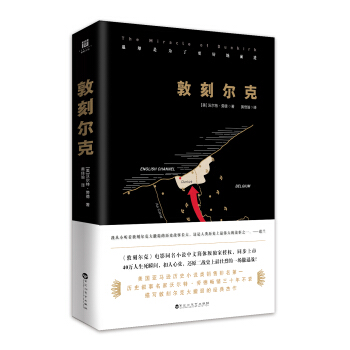
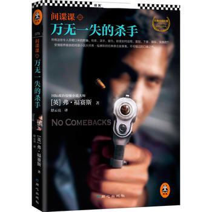
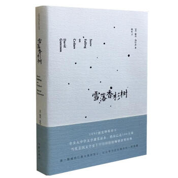
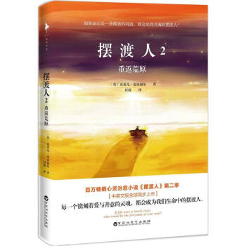
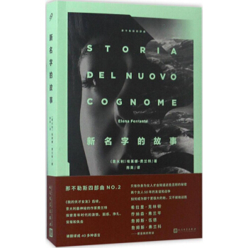
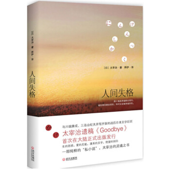
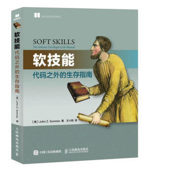

# 2018年，我读了这些书

## 《敦刻尔克》（第1本）

## 《间谍课：万无一失的杀手》（第2本）

## 《白夜行》（第3本）

## 《雪落香杉树》（第4本）

## 《摆渡人2》（第5本）

## 《沉默的大多数》（第6本）

## 《高难度对话》（第7本书）

## 《新名字的故事》（第8本书）

## 《我的天才女友》（第9本书）

## 《人间失格》（第10本书）

## 《软技能 代码之外的生存指南》（第11本书）

# 2018年，我看了这些电影

## 1）神秘巨星（2月8日）

## 2）小萝莉的猴神大叔（3月9日）

## 3）比得兔（3月4日）

## 4）红海行动（2月23日）

## 5）前任3:再见前任

# 2018年，我看了这些话剧

## 那次奋不顾身的爱情
