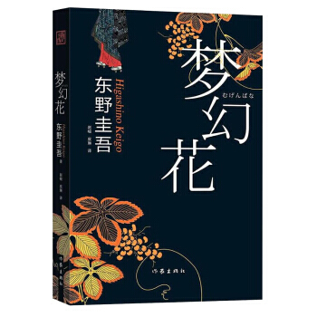
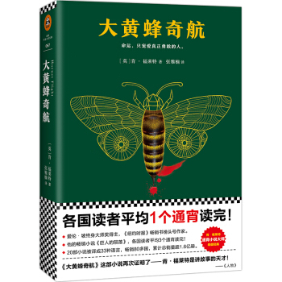
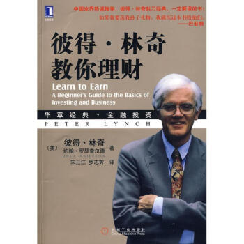

# 2018年，我读了这些书

## 1.《敦刻尔克》（第1本）

### 读后感想

只有读了原著，才有可能在脑海中将历史真实事件进行最大程度的还原。

从一开始的英军撤退计划的制定，到后期后知后觉的法军放弃坚守阵地，进而妥协随英一起撤离到多佛地区。以及丘吉尔为了盟军的条约，提出与法军手挽手肩并肩撤退的命令，到最终依然无法避免在战后招致法军高层怀恨在心，将“背信弃义的英军”重重的挂在英国的头上。

历经希特勒的“休战”，德国空军首领的信誓旦旦，英吉利海峡连续9天的风平浪静，也或者其他原因，让敦刻尔克大撤退占据了所有的天时地利任何.期间，斯图卡和亨克尔战斗机一系列的轰炸，各种人性懦弱和无能的一面暴露无遗，但也涌现出来更多可歌可泣，舍己为人的英雄事迹。

情节是由很多个人物堆砌而成，看似凌乱，却更准确而生动的还原了历史真想。

## 2.《间谍课：万无一失的杀手》（第2本）

本书围绕10个独立的小故事，针对具有悬疑侦破性质的情节以扣人心弦的方式进行展开。通过情节抓住读者的好奇心。

### 1）万无一失的杀手

男主人翁爱上一位已婚女性，由爱生妒，由此策划的一场谋害爱人丈夫的行动。通过雇佣的杀手的确圆满完成任务，不仅带走了爱人丈夫的性命，同时也带走了目击者爱人的生命。的确“万无一失”，却极具讽刺性，密谋策划良久，到头终究一场空。

### 2）爱尔兰没有蛇

一个来自印度的学医的黑人大学生为了抵抗高大凶猛的白人工头的欺辱，策划出一场悄无声息的杀人案。黑人小伙从印度引来一条锯鳞蝰蛇，设陷让工头中招，然而事情走向并未如黑人小伙的预期，毒蛇却意外的被带入了工头的家中，直接危机工头的家人，最后毒蛇被其家人及时发现，而工头却以“爱尔兰没有蛇”轻易接触毒蛇并将其作为恶作剧的工具来嘲弄黑人大学生，却不料自己已中蛇毒。只能万事因果，凡事都各有自己的宿命。文中最后，黑人小伙再次强调“爱尔兰没有蛇”，因而这个蛇不会再有其他同种蛇与其繁殖，此蛇会随时间慢慢死去并消失。然而，剧情峰回路转，锯鳞蝰蛇却在蛇洞里已悄悄将十几个蛇卵带到了爱尔兰。。。

### 3）倒霉的日子

一帮土匪欲在海关出口处抢劫事先侦探好的九千瓶白兰地，从而发一笔横财。然而，阴差阳错却抢了一车肥料。最后，夜间在林间小道上和一农夫开着一辆拖拉车跟着一节拖挂货车相撞了。却迎面碰到警察的巡逻车，正如人们常说的那样，人在倒霉时，喝凉水都塞牙缝。正在警长询问期间将要解除警戒期间，发现了一车的军火，直到最终这帮土匪才发现原来抢的“肥料”却是走私的军火。最后，土匪被警察带走了。很明显未来两年将会在哪里度过。的确是倒霉的日子。

### 4）敲诈

### 5）谨慎的人

### 6）特权

### 7）天职

### 8）诈骗

### 9）用作证词

### 10）鱼王

## 3.《白夜行》（第3本）

## 4.《雪落香杉树》（第4本）

## 5.《摆渡人2》（第5本）

## 6.《沉默的大多数》（第6本）

## 7.《高难度对话》（第7本书）

## 8.《新名字的故事》（第8本书）

“只有你身为女人，才会直到这些丑陋的秘密；两个女人50年的友谊和战争”这是埃莱娜那不了色四部曲的第二部简介。

细致描写了两个女孩的细腻心理活动。自律并优秀的莱农和聪慧国人但特立独行的莉拉，每个女孩的成长过程中或多或少都存在她们身上的特点，带有她们的影子。尤其心疼莱农，即作者本人，活得太隐忍，太客气，一直坚持“付出我能付出的，获得我能获得的，忍受那些该忍受的事情。”

意大利这位神秘作家也用极其扎实的故事告诉n女人们，为什么不能太早结婚以及为什么要坚持读书。

## 9.《我的天才女友》（第9本书）

## 10.《人间失格》（第10本书）

的确是一本很丧的书，从头到尾满满的负能量。是否能断定为太宰治的遗书？不得而知。但从中也能窥探出另一种人生，以及人生中夹杂着很多的无奈。与其太过在意和敏感的活着，不如洒脱没心没肺的去应对，人生获取能多一些乐趣，少一些烦恼。

## 11.《软技能 代码之外的生存指南》（第11本书）

## 12.《梦幻花》（第12本书）

一种能使人产生幻觉并成瘾的黄色牵牛花种子，被政府秘密隔离，从而成为人间不存在的禁断之花。看似毫无关联哪怕间隔几十年的突发事件，依然有着千丝万缕的联系。而由神秘之花引发的一系列命案，一段段不为人知的背后家族的使命感逐渐浮出水面。包括：爱情，亲戚，友情。

## 13.《大黄蜂奇航》（第13本书）

## 14.《彼得林奇教你理财》（第14本书）

去做感兴趣的事情，并且倾其所有地为之付出，钱自然而然就会有了。

# 2018年，我看了这些电影

## 1）神秘巨星（2月8日）

## 2）小萝莉的猴神大叔（3月9日）

## 3）比得兔（3月4日）

## 4）红海行动（2月23日）

## 5）前任3:再见前任

## 6)厉害了，我的国（3月23日）

## 7）头号玩家（4月4日）

# 2018年，我看了这些话剧

## 那次奋不顾身的爱情
