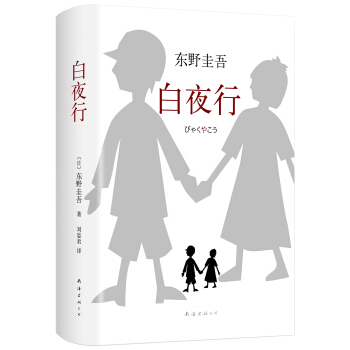
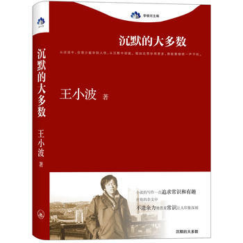
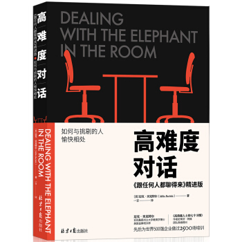
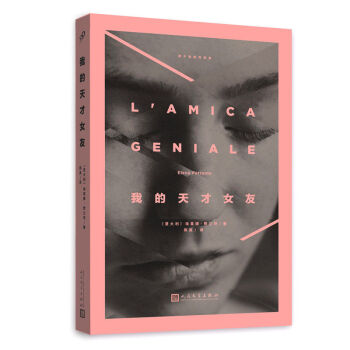

# 2018年，我读了这些书

## 敦刻尔克（第1本）

## 间谍课：万无一失的杀手（第2本）

## 白夜行（第3本）

## 雪落香杉树（第4本）

## 摆渡人2（第5本）

## 沉默的大多数（第6本）

## 高难度对话（第7本书）

## 新名字的故事（第8本书）

## 我的天才女友（第9本书）（在读）

# 2018年，我看了这些电影

## 神秘巨星（2月8日）

## 小萝莉的猴神大叔（3月9日）

## 比得兔（3月4日）

## 红海行动（2月23日）

## 前任3:再见前任
