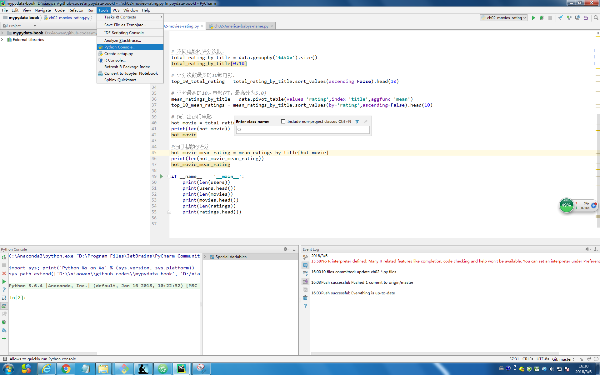

假设已经安装Pycharm的前提下，然后进行如下步骤

## 安装jupyter

- 如果安装了`anaconda`，那么则自动也安装了`jupyter`
- 如果没有安装`anaconda`，则输入如下命令

```
pip install jupyter
```

## 在Pycharm中打开jupyter


- 打开PyCharm
- 选择菜单栏中的`Tools`>`Python Console`



## 使用`jupyter`

- 换行按`Shift + Enter`
